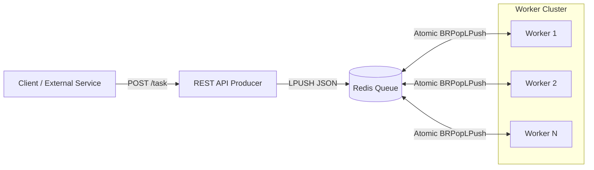

# Go Distributed Queue


**A high-throughput, fault-tolerant distributed task processing system implementing the Reliable Queue Pattern.**

Designed to handle concurrent workloads with zero data loss, ensuring robustness in distributed environments through atomic state transitions and graceful lifecycle management.

## Architecture

The system decouples task ingestion from processing using a persistent Redis layer, managed by a scalable pool of concurrent workers.



## Key Engineering Concepts

### Reliable Queue Pattern (Atomic RPOPLPUSH)
Implements the **Reliable Queue Pattern** to guarantee **at-least-once processing**.
- Tasks are atomically moved from `tasks:pending` to `tasks:processing` using `BRPopLPush`.
- This ensures that if a worker crashes mid-execution, the task remains in the `processing` list and is not lost.

### Fault Tolerance & Retry Logic
- **Automatic Retries**: Failed tasks are retried up to 3 times with exponential backoff.
- **Dead Letter Queue (DLQ)**: Tasks that exceed the retry limit are moved to a `dead_letter` queue for manual inspection, preventing poison pills from clogging the system.

### Real-Time Monitoring
- **Live Dashboard**: A web-based dashboard provides real-time visibility into queue depths (Pending, Processing, Dead Letter).
- **JSON API**: Exposes metrics via a simple JSON endpoint for external tools.

### Concurrency & Parallelism
Leverages Go's scheduler and efficient goroutines to maximize throughput.
- **Worker Pools**: Spawns multiple concurrent processors managed via `sync.WaitGroup`.
- **Non-blocking I/O**: Efficiently handles idle waiting on Redis connections.

### Graceful Shutdowns
Implements robust signal handling (`SIGINT`, `SIGTERM`) using `os/signal` and context cancellation to ensure all in-flight tasks complete execution before termination.

## Quick Start

### Prerequisites
- Docker & Docker Compose
- Go 1.23+

### 1. Start the Infrastructure
Initialize the Redis instance.
```bash
docker-compose up -d redis
```

### 2. Start the Services
Run each service in a separate terminal:

**Producer API (Port 8085)**
```bash
go run cmd/producer/main.go
# Starts HTTP server on :8085
```

**Monitor Dashboard (Port 8082)**
```bash
go run cmd/monitor/main.go
# Dashboard available at http://localhost:8082
```

**Worker Pool**
```bash
go run cmd/worker/main.go
# Starts the worker node
```

### 3. Dispatch Tasks
You can send tasks manually or run the stress test script to simulate load.

**Using the Stress Test Script:**
This script sends a burst of concurrent requests to the producer.
```bash
go run scripts/stress_load/main.go
```

**Using cURL:**
```bash
curl -X POST http://localhost:8085/task \
     -H "Content-Type: application/json" \
     -d '{"type": "email-notification", "payload": "user@example.com"}'
```

**Response:**
```json
{
  "status": "queued",
  "task_id": "1734301548123456789"
}
```

## API Endpoints

### Producer (`:8085`)
- `POST /task`: Enqueues a new task.
    - Body: `{"type": "string", "payload": "any"}`
    - Returns: `202 Accepted` with Task ID.

### Monitor (`:8082`)
- `GET /`: HTML Dashboard.
- `GET /stats`: JSON metrics (`pending`, `processing`, `dead_letter` counts).

## Future Improvements
- **Metrics Export**: Prometheus integration for queue depth and latency monitoring.
- **Dynamic Scaling**: Horizontal Pod Autoscaling (HPA) based on queue lag.
