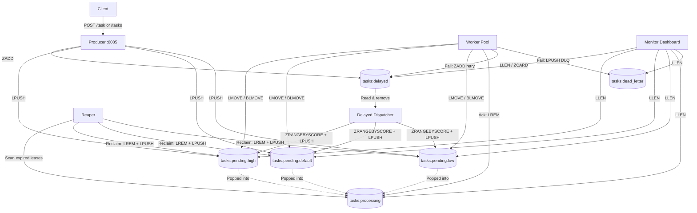

# Go Distributed Queue

[](https://github.com/YehiaGewily/Go-distributed-queue/actions/workflows/ci.yml)
[](https://golang.org)
[](https://www.docker.com)
[](https://redis.io)

A production-grade, high-throughput, fault-tolerant distributed task queue implementing the **Reliable Queue Pattern**. The system guarantees **at-least-once delivery** through atomic state transitions and a lease-based crash recovery reaper, verified under concurrent worker failures by automated chaos testing. Features include multi-tier priority queues, delayed execution, batch ingestion, and native Prometheus instrumentation.

---

## Architecture

The system decouples task ingestion from execution via Redis queues. A background dispatcher manages scheduled executions, while concurrent workers poll tasks sequentially in priority order.


```mermaid
flowchart TD
    Client -->|POST /task or /tasks| Producer[Producer :8085]
    Producer -->|ZADD| DelayedQueue[(tasks:delayed)]
    Producer -->|LPUSH| PendingHigh[(tasks:pending:high)]
    Producer -->|LPUSH| PendingDefault[(tasks:pending:default)]
    Producer -->|LPUSH| PendingLow[(tasks:pending:low)]
    
    Dispatcher[Delayed Dispatcher] -->|ZRANGEBYSCORE + LPUSH| PendingHigh
    Dispatcher -->|ZRANGEBYSCORE + LPUSH| PendingDefault
    Dispatcher -->|ZRANGEBYSCORE + LPUSH| PendingLow
    DelayedQueue -.->|Read & remove| Dispatcher
    
    Worker[Worker Pool] -->|LMOVE / BLMOVE| PendingHigh
    Worker -->|LMOVE / BLMOVE| PendingDefault
    Worker -->|LMOVE / BLMOVE| PendingLow
    
    PendingHigh -.->|Popped into| Processing[(tasks:processing)]
    PendingDefault -.->|Popped into| Processing
    PendingLow -.->|Popped into| Processing
    
    Worker -->|Ack: LREM| Processing
    Worker -->|Fail: ZADD retry| DelayedQueue
    Worker -->|Fail: LPUSH DLQ| DLQ[(tasks:dead_letter)]
    
    Reaper[Reaper] -->|Scan expired leases| Processing
    Reaper -->|Reclaim: LREM + LPUSH| PendingHigh
    Reaper -->|Reclaim: LREM + LPUSH| PendingDefault
    Reaper -->|Reclaim: LREM + LPUSH| PendingLow
    
    Monitor[Monitor Dashboard] -->|LLEN / ZCARD| DelayedQueue
    Monitor -->|LLEN| PendingHigh
    Monitor -->|LLEN| PendingDefault
    Monitor -->|LLEN| PendingLow
    Monitor -->|LLEN| Processing
    Monitor -->|LLEN| DLQ
```

---

## Reliability

Workers lease tasks during execution by setting a key in Redis (`task:lease:<id>`) for `LEASE_TTL_SECONDS`. While the task is active, a per-task goroutine refreshes this lease every `LEASE_TTL_SECONDS / 3`. 

If a worker process dies mid-flight (due to OOM, host crash, or SIGKILL), its lease key expires. A background **reaper** sweeps the `tasks:processing` queue, detecting orphaned tasks without leases and reclaiming them back into their original priority queues atomically via a Lua script.

$$\text{Reclaim Latency}_{\text{max}} \approx \text{LEASE\_TTL\_SECONDS} + \text{REAPER\_INTERVAL\_SECONDS}$$

With default configurations ($30\text{ s}$ lease + $5\text{ s}$ sweep), crashed worker tasks are safely recovered within $35\text{ seconds}$ with zero task loss.

### Idempotency

Producers can opt into deduplication for non-idempotent task handlers by attaching an `idempotency_key` field to the task payload during enqueueing. Workers skip execution if a task with the same key has already been executed within the configured time window.

* **How to use**: Add `"idempotency_key": "some-unique-string"` when enqueueing a task.
* **Guarantee**: At most one successful execution per key within the TTL window.
* **Config**: The `IDEMPOTENCY_KEY_TTL_SECONDS` env var controls how long keys are cached (default `86400` = 24h).
* **Pattern**: A **claim-then-confirm** pattern is used:
  1. **Claim**: On start of processing, the worker sets `task:done:<idempotency_key>` to `"in_flight"` with a short `5-minute` TTL (lease window). If the key already exists, the task is skipped and marked as duplicate.
  2. **Confirm**: Upon successful execution, the key's value is set to `"done"` and its TTL is extended to `IDEMPOTENCY_KEY_TTL_SECONDS`.
  3. **Release**: If execution fails, the worker deletes the key so that subsequent retries can run successfully.

---

## Configuration

All configuration is driven by environment variables:

| Variable | Default | Description |
|---|---|---|
| `REDIS_ADDR` | `localhost:6379` | Redis host and port address |
| `REDIS_DB` | `0` | Redis database index |
| `WORKER_COUNT` | `1` | Concurrency: number of worker goroutines per worker node |
| `LEASE_TTL_SECONDS` | `30` | Task lease TTL (seconds) before crash recovery triggers |
| `REAPER_ENABLED` | `true` | Runs the orphaned-task recovery sweep |
| `REAPER_INTERVAL_SECONDS` | `5` | Latency between reaper sweeps (seconds) |
| `DISPATCHER_ENABLED` | `true` | Runs the scheduled-tasks dispatcher |
| `DISPATCHER_INTERVAL_SECONDS`| `1` | Interval between scheduled-task sweeps (seconds) |
| `DISPATCHER_INTERVAL_MS` | `0` | Sub-second dispatcher override (milliseconds, test use only) |
| `WORKER_SLEEP_MS` | `1000` | Mock processing delay per task (milliseconds) |
| `WORKER_FAILURE_PCT` | `25` | Mock task processing failure rate (percentage: 0-100) |
| `WORKER_METRICS_ADDR` | `:8086` | Listen port for worker Prometheus metrics |

---

## API & Metrics

Each binary exposes a `/metrics` endpoint compatible with Prometheus:
- **Producer**: `http://localhost:8085/metrics`
- **Worker**: `http://localhost:8086/metrics`
- **Monitor**: `http://localhost:8082/metrics`

### Prom Metrics Exposed

| Metric | Type | Labels | Description |
|---|---|---|---|
| `queue_depth` | Gauge | `queue` (`pending_high`, `pending_default`, `pending_low`, `delayed`, `processing`, `dlq`) | Current depth of each state queue |
| `task_duration_seconds` | Histogram | `type`, `status` (`success`, `failure`) | Duration of task execution |
| `task_enqueue_total` | Counter | `type` | Total count of ingested tasks |
| `task_retries_total` | Counter | `type` | Total count of retried tasks |
| `task_reclaimed_total` | Counter | — | Total count of recovered crashed tasks |

A pre-configured Grafana dashboard template is available at `deploy/grafana/queue.json`.

---

## Quick Start

### 1. Start the Stack
Boot up the complete Go Distributed Queue stack (Redis, Producer API, 5-Worker Pool, and Monitor Dashboard):
```bash
docker compose up -d --build
```

### 2. Monitor Metrics
- Monitor Dashboard (HTML): `http://localhost:8082`
- Monitor Dashboard (JSON): `http://localhost:8082/stats`

### 3. Enqueue Tasks

**Single Task (with priority and execute_at scheduling):**
```bash
curl -X POST http://localhost:8085/task \
     -H "Content-Type: application/json" \
     -d '{
       "type": "email",
       "payload": "user@example.com",
       "priority": "high",
       "execute_at": "2026-06-03T12:00:00Z"
     }'
```

**Batch Tasks (pipelined high-throughput):**
```bash
curl -X POST http://localhost:8085/tasks \
     -H "Content-Type: application/json" \
     -d '[
       {"type": "job", "payload": "1", "priority": "high"},
       {"type": "job", "payload": "2", "priority": "low"},
       {"type": "job", "payload": "3"}
     ]'
```

---

## Testing

Run tests locally with a running Redis instance or using mock miniredis:

```bash
# 1. Run Unit Tests (mocked via miniredis)
go test ./... -count=1
# Proves: logical correctness of client operations, dispatcher priority routing, and parser helpers.

# 2. Run Integration Tests (requires docker-compose up redis)
go test -tags=integration ./... -count=1 -timeout 60s
# Proves: end-to-end task flows, actual recovery of crashed workers, and execution scheduling accuracy.

# 3. Run Chaos Tests (requires docker-compose up redis)
go test -tags=chaos ./internal/reaper/... -count=1 -timeout 120s
# Proves: zero task loss and zero duplicates under simulated worker crashes and restarts.
```

---

## Future Improvements

- **Authentication**: Secure the ingestion endpoints (`/task` and `/tasks`) using Bearer Token middleware.
- **Dynamic Scaling**: Implement horizontal worker scaling based on `queue_depth` thresholds.
