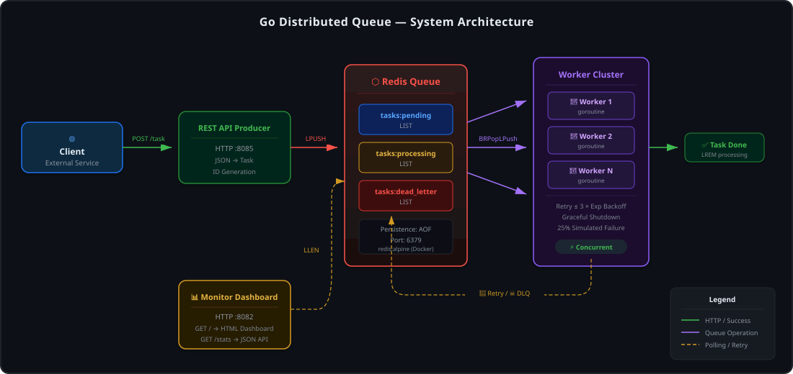
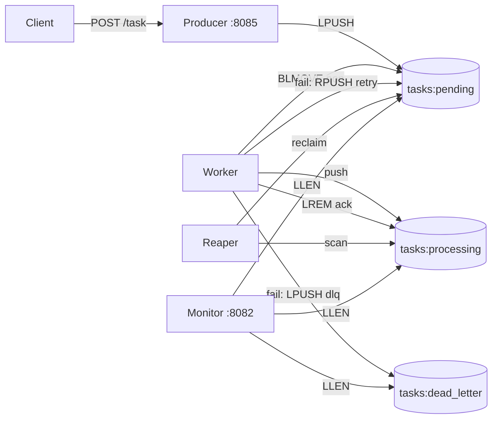

# Go Distributed Queue


  

**A high-throughput, fault-tolerant distributed task processing system implementing the Reliable Queue Pattern.**

Designed to handle concurrent workloads with zero data loss, ensuring robustness in distributed environments through atomic state transitions and graceful lifecycle management.

## Architecture

The system decouples task ingestion from processing using a persistent Redis layer, managed by a scalable pool of concurrent workers.

<p align="center">
  
</p>

## Key Engineering Concepts

### Reliable Queue Pattern (Atomic LMOVE)
Implements the **Reliable Queue Pattern** to guarantee **at-least-once delivery** with reaper-based crash recovery.
- Tasks are atomically moved from `tasks:pending` to `tasks:processing` using `BLMove`.
- When a worker picks up a task, it sets a lease key (`task:lease:<id>`) with a configurable TTL. A per-task goroutine refreshes the lease while processing.
- If a worker crashes, its lease expires. A background **reaper** goroutine detects orphaned tasks and moves them back to `tasks:pending` for re-processing.
- **Max reclaim latency** ≈ `LEASE_TTL_SECONDS` + `REAPER_INTERVAL_SECONDS` (default ~35 s).
- All reclaim steps are atomic via a Lua script, preventing concurrent reapers from double-reclaiming.

### Fault Tolerance & Retry Logic
- **Automatic Retries**: Failed tasks are retried up to 3 times.
- **Dead Letter Queue (DLQ)**: Tasks that exceed the retry limit are moved to a `dead_letter` queue for manual inspection, preventing poison pills from clogging the system.
- **Crash Recovery**: Lease-based reaper reclaims orphaned tasks within `LEASE_TTL_SECONDS + REAPER_INTERVAL_SECONDS`.

### Real-Time Monitoring
- **Live Dashboard**: A web-based dashboard provides real-time visibility into queue depths (Pending, Processing, Dead Letter).
- **JSON API**: Exposes metrics via a simple JSON endpoint for external tools.

### Task IDs
- IDs are generated using **ULID** (`github.com/oklog/ulid/v2`), which is time-sortable and collision-free under concurrent load.

### Concurrency & Parallelism
Leverages Go's scheduler and efficient goroutines to maximize throughput.
- **Worker Pools**: Spawns multiple concurrent processors managed via `sync.WaitGroup`.
- **Non-blocking I/O**: Efficiently handles idle waiting on Redis connections.

### Graceful Shutdowns
Implements robust signal handling (`SIGINT`, `SIGTERM`) using `os/signal` and context cancellation to ensure all in-flight tasks complete execution before termination.

## Quick Start

### Prerequisites
- Docker & Docker Compose
- Go 1.23+

### 1. Start the Infrastructure
Initialize the Redis instance.
```bash
docker-compose up -d redis
```

### 2. Start the Services
Run each service in a separate terminal:

**Producer API (Port 8085)**
```bash
go run cmd/producer/main.go
# Starts HTTP server on :8085
```

**Monitor Dashboard (Port 8082)**
```bash
go run cmd/monitor/main.go
# Dashboard available at http://localhost:8082
```

**Worker Pool**
```bash
go run cmd/worker/main.go
# Starts the worker node
```

### 3. Dispatch Tasks
You can send tasks manually or run the stress test script to simulate load.

**Using the Stress Test Script:**
This script sends a burst of concurrent requests to the producer.
```bash
go run scripts/stress_load/main.go
```

**Using cURL:**
```bash
curl -X POST http://localhost:8085/task \
     -H "Content-Type: application/json" \
     -d '{"type": "email-notification", "payload": "user@example.com"}'
```

**Response:**
```json
{
  "status": "queued",
  "task_id": "01JABCDEF0123456789ABCDEFGH"
}
```

## API Endpoints

### Producer (`:8085`)
- `POST /task`: Enqueues a new task.
    - Body: `{"type": "string", "payload": "any"}`
    - Returns: `202 Accepted` with Task ID.
- `GET /metrics`: Prometheus metrics endpoint.

### Worker (`:8086`)
- `GET /metrics`: Prometheus metrics endpoint.

### Monitor (`:8082`)
- `GET /`: HTML Dashboard.
- `GET /stats`: JSON metrics (`pending`, `processing`, `dead_letter` counts).
- `GET /metrics`: Prometheus metrics endpoint.

## Configuration

All configuration is driven by environment variables with sensible defaults:

| Variable | Default | Description |
|---|---|---|
| `REDIS_ADDR` | `localhost:6379` | Redis server address |
| `LEASE_TTL_SECONDS` | `30` | Lease TTL for in-flight tasks (seconds) |
| `REAPER_ENABLED` | `true` | Enable the orphaned-task reaper |
| `REAPER_INTERVAL_SECONDS` | `5` | Reaper sweep interval (seconds) |
| `WORKER_SLEEP_MS` | `1000` | Simulated task processing time (ms) |
| `WORKER_FAILURE_PCT` | `25` | Simulated failure rate (0-100%) |
| `WORKER_METRICS_ADDR` | `:8086` | Worker Prometheus metrics listen address |

## Metrics

Each binary exposes a `/metrics` endpoint compatible with Prometheus. The monitor additionally updates `queue_depth` gauges on a 5 s ticker.

| Metric | Type | Labels | Description |
|---|---|---|---|
| `queue_depth` | Gauge | `queue` (pending, processing, dlq, delayed) | Number of tasks in each queue |
| `task_duration_seconds` | Histogram | `type`, `status` | Time to process a task |
| `task_enqueue_total` | Counter | `type` | Total tasks enqueued |
| `task_retries_total` | Counter | `type` | Total task retries |
| `task_reclaimed_total` | Counter | — | Total orphaned tasks reclaimed by the reaper |

A pre-built Grafana dashboard is available at `deploy/grafana/queue.json`.

## Architecture Diagram


```mermaid
flowchart LR
    C[Client] -->|POST /task| P[Producer :8085]
    P -->|LPUSH| RP[(tasks:pending)]
    W[Worker] -->|BLMOVE pop| RP
    W -->|push| PR[(tasks:processing)]
    W -->|LREM ack| PR
    W -->|fail: RPUSH retry| RP
    W -->|fail: LPUSH dlq| DLQ[(tasks:dead_letter)]
    R[Reaper] -->|scan| PR
    R -->|reclaim| RP
    M[Monitor :8082] -->|LLEN| RP
    M -->|LLEN| PR
    M -->|LLEN| DLQ
```

