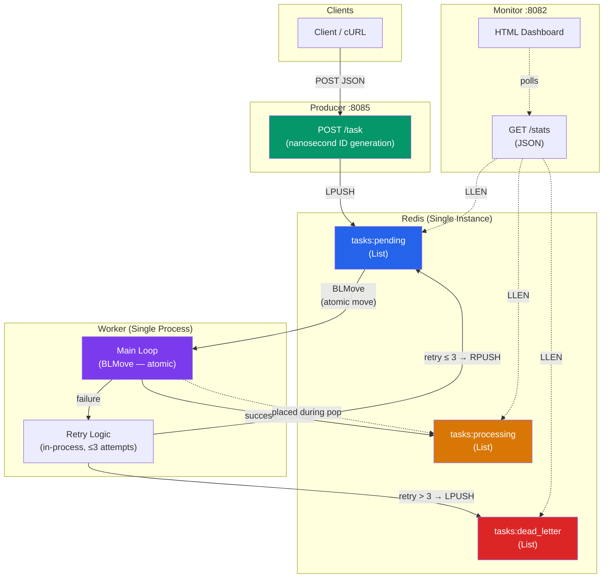

# Go Distributed Queue — Improvement Plan

A phased roadmap to move the project from "working queue demo" to "production-grade, defensible system." Phases are ordered by leverage: each one is independently shippable, and earlier phases unblock later ones.

---

## Target Architecture

### Current State

The system today is a straightforward producer → Redis → worker pipeline with a monitoring dashboard. There is no crash recovery, no lease mechanism, and IDs are generated from nanosecond timestamps.



### Target State (After All Phases)

The improved architecture adds crash recovery via lease-based reaping, delayed/scheduled task support, priority queues, Prometheus observability, structured logging, API hardening, and idempotency guarantees.

```mermaid
flowchart TB
    subgraph Clients
        C1["Client / cURL"]
        C2["Batch Client"]
    end

    subgraph "Producer :8085"
        AUTH["Auth Middleware\n(Bearer Token)"]
        RL["Rate Limiter\n(per-IP, 100 req/s)"]
        VAL["Input Validation\n(body size ≤ 64KB)"]
        EP1["POST /task\n(ULID generation)"]
        EP2["POST /tasks\n(Batch — Redis Pipeline)"]
        PMET["/metrics\n(Prometheus)"]
    end

    subgraph "Redis (AOF Persistence)"
        PH["tasks:pending:high\n(List)"]
        PD["tasks:pending:default\n(List)"]
        PL["tasks:pending:low\n(List)"]
        PR["tasks:processing\n(List)"]
        DLQ["tasks:dead_letter\n(List)"]
        DEL["tasks:delayed\n(Sorted Set — score = unix ts)"]
        LEASE["task:lease:{id}\n(Key — TTL 30s)"]
        IDEMP["task:done:{key}\n(Key — TTL 24h)"]
    end

    subgraph "Worker Cluster"
        direction TB
        subgraph "Worker N (each instance)"
            WL["Poll Loop\n(BLMOVE — high → default → low)"]
            LR["Lease Refresh\n(goroutine, every 10s)"]
            IG["Idempotency Guard\n(SETNX check)"]
            HANDLER["Task Handler"]
            SLOG["slog JSON Logger"]
            OTEL["OTel Span\n(traceparent propagation)"]
        end
        REAPER["Reaper Goroutine\n(scans processing every 5s)"]
        DISP["Delayed Dispatcher\n(polls delayed every 1s)"]
        WMET["/metrics\n(Prometheus)"]
    end

    subgraph "Monitor :8082"
        DASH["HTML Dashboard"]
        STATS["GET /stats\n(JSON)"]
        MMET["/metrics\n(Prometheus)"]
    end

    subgraph "Observability Stack"
        PROM["Prometheus"]
        GRAF["Grafana Dashboard"]
        JAEG["Jaeger / OTel Collector"]
    end

    %% Client → Producer
    C1 -->|"POST JSON"| AUTH
    C2 -->|"POST JSON array"| AUTH
    AUTH --> RL --> VAL
    VAL --> EP1
    VAL --> EP2

    %% Producer → Redis
    EP1 -->|"LPUSH"| PD
    EP1 -->|"LPUSH (priority=high)"| PH
    EP1 -->|"LPUSH (priority=low)"| PL
    EP1 -->|"ZADD (execute_at)"| DEL
    EP2 -->|"Pipeline LPUSH"| PD

    %% Delayed Dispatcher
    DISP -->|"ZRANGEBYSCORE + LPUSH\n(Lua atomic)"| DEL
    DISP -->|"moves due tasks"| PD

    %% Worker → Redis
    WL -->|"BLMOVE\n(priority order)"| PH
    WL -->|"BLMOVE"| PD
    WL -->|"BLMOVE"| PL
    WL -->|"SET EX 30"| LEASE
    LR -->|"refresh TTL"| LEASE
    IG -->|"SETNX"| IDEMP
    WL --> IG --> HANDLER
    HANDLER -->|"success → LREM"| PR
    HANDLER -->|"failure ≤ 3 → ZADD\n(now + backoff)"| DEL
    HANDLER -->|"failure > 3 → LPUSH"| DLQ

    %% Reaper
    REAPER -->|"scan"| PR
    REAPER -->|"check lease expired?"| LEASE
    REAPER -->|"reclaim → LREM + LPUSH"| PD

    %% Monitor
    DASH -.->|"polls"| STATS
    STATS -.->|"LLEN × queues"| PH
    STATS -.->|"LLEN"| PR
    STATS -.->|"LLEN"| DLQ
    STATS -.->|"ZCARD"| DEL

    %% Observability
    PMET -.-> PROM
    WMET -.-> PROM
    MMET -.-> PROM
    PROM -.-> GRAF
    OTEL -.->|"traces"| JAEG
    SLOG -.->|"JSON logs"| JAEG

    style PH fill:#dc2626,color:#fff
    style PD fill:#2563eb,color:#fff
    style PL fill:#6b7280,color:#fff
    style PR fill:#d97706,color:#fff
    style DLQ fill:#991b1b,color:#fff
    style DEL fill:#7c3aed,color:#fff
    style LEASE fill:#059669,color:#fff
    style IDEMP fill:#059669,color:#fff
    style AUTH fill:#b91c1c,color:#fff
    style REAPER fill:#ea580c,color:#fff
    style DISP fill:#7c3aed,color:#fff
    style PROM fill:#e85d04,color:#fff
    style GRAF fill:#f59e0b,color:#000
    style JAEG fill:#0ea5e9,color:#fff
```



### Key Architectural Changes Summary

| Area | Current | Target | Phase |
|---|---|---|---|
| **Crash Recovery** | None — orphaned tasks lost | Lease-based reaper reclaims within ≤60s | 1.1 |
| **Queue Primitive** | `BRPopLPush` (deprecated) | `BLMOVE` | 1.2 | ~~DONE~~ |
| **ID Generation** | `time.Now().UnixNano()` (collision risk) | ULID (lexicographic, unique) | 1.3 |
| **Idempotency** | Undocumented | `SETNX` guard with 24h TTL | 1.4 |
| **Scheduling** | Not supported | Sorted set + dispatcher goroutine | 2.1 |
| **Priority** | Single FIFO | Three-tier priority queues | 2.2 |
| **Batch Ingestion** | 1 HTTP req per task | `POST /tasks` with Redis pipeline | 2.3 |
| **Metrics** | Dashboard only | Prometheus `/metrics` + Grafana | 3.1 |
| **Logging** | `log.Printf` | `slog` JSON structured logging | 3.2 |
| **Tracing** | None | OpenTelemetry `traceparent` propagation | 3.3 |
| **API Security** | Open | Bearer token + rate limit + body cap | 4.1 |
| **Redis Security** | No auth | Password required in non-dev mode | 4.2 |

---

## Phase 1 — Correctness (Critical)

These are the items where the current code does *not* deliver what the README claims. Ship these first.

### 1.1 Reaper for orphaned tasks in `tasks:processing`

**Problem:** `BRPOPLPUSH` moves a task to the processing list atomically, but if a worker crashes (SIGKILL, OOM, host failure), the task sits there forever. The current system loses the task in practice while claiming reliability.

**Design:**
- Each worker, on picking up a task, sets a lease key: `SET task:lease:<id> <worker_id> EX 30`.
- Worker periodically refreshes the lease while processing (every 10s).
- A separate **reaper** goroutine (run inside the worker binary, or as a sidecar) scans `tasks:processing` every 5s. For each entry, it checks if `task:lease:<id>` still exists. If not → the worker died → `LREM` from processing, `LPUSH` back to pending, increment a `reclaimed_total` counter.

**Acceptance criteria:**
- Integration test: enqueue 100 tasks, SIGKILL worker mid-flight, all 100 eventually complete.
- Reclaim latency ≤ 2× lease TTL.

**Files to add/modify:**
- `internal/reaper/reaper.go` — new
- `internal/worker/worker.go` — add lease refresh goroutine per task
- `cmd/worker/main.go` — start reaper alongside worker pool

---

### 1.2 Replace deprecated `BRPOPLPUSH` with `BLMOVE`

**Problem:** `BRPOPLPUSH` is deprecated as of Redis 6.2. `BLMOVE` is the supported equivalent.

**Change:**
```go
// Before
client.BRPopLPush(ctx, "tasks:pending", "tasks:processing", 0)

// After
client.BLMove(ctx, "tasks:pending", "tasks:processing", "RIGHT", "LEFT", 0)
```

**Acceptance criteria:** No deprecation warnings; behavior identical.

---

### 1.3 Replace nanosecond timestamp IDs with ULIDs

**Problem:** `time.Now().UnixNano()` collides under concurrent load (two goroutines in the same nanosecond produce identical IDs). The stress test will silently overwrite tasks if Redis is keyed by ID anywhere.

**Change:**
- Add `github.com/oklog/ulid/v2`.
- Replace ID generation in producer:
  ```go
  id := ulid.Make().String()
  ```
- ULIDs are lexicographically sortable, so debugging logs stay readable.

**Acceptance criteria:** Stress test with 10k concurrent enqueues produces zero duplicate IDs.

---

### 1.4 Idempotency contract

**Problem:** At-least-once delivery means handlers must tolerate duplicate execution. Currently undocumented and unenforced.

**Design:**
- Add optional `idempotency_key` field to task payload.
- Before executing, worker does `SETNX task:done:<key> 1 EX 86400`. If it returns 0, the task already ran — skip and ack.
- Document this contract in the README so producers know to set the key for non-idempotent operations.

**Acceptance criteria:**
- Integration test: enqueue the same `idempotency_key` 5 times, handler runs exactly once.

---

## Phase 2 — Features

### 2.1 Delayed/scheduled tasks via sorted set

**Problem:** Retries currently use `time.Sleep` inside the worker (assumption based on README), which blocks a worker slot for the entire backoff duration. Also: no way to schedule a task for future execution.

**Design:**
- New Redis key: `tasks:delayed` (sorted set, score = unix timestamp when task should execute).
- On retry-after-failure: `ZADD tasks:delayed <now + backoff> <task_json>`.
- New **dispatcher** goroutine polls every 1s: `ZRANGEBYSCORE tasks:delayed -inf <now>`, moves results to `tasks:pending` via Lua script (atomic).

**Bonus:** producers can now schedule tasks for the future:
```json
POST /task
{"type": "email", "payload": "...", "execute_at": "2026-06-01T12:00:00Z"}
```

**Acceptance criteria:**
- Worker availability is independent of retry backoff duration.
- Tasks scheduled for future execution fire within ±1s of target time.

---

### 2.2 Priority queues

**Problem:** Single FIFO means a flood of low-priority tasks starves high-priority ones.

**Design:**
- Three queues: `tasks:pending:high`, `tasks:pending:default`, `tasks:pending:low`.
- Workers poll via `BLMOVE` in priority order with a short timeout per queue (e.g., 1s on high, then check default, then low with longer timeout).
- Producer accepts `priority` field (default = "default").

**Acceptance criteria:**
- With 1000 low-priority tasks queued, a single high-priority task is picked up within 1s.

---

### 2.3 Batch enqueue endpoint

**Problem:** Stress-testing 10k tasks = 10k HTTP requests, which mostly measures HTTP overhead, not queue throughput.

**Design:**
```
POST /tasks  (plural)
[
  {"type": "...", "payload": "..."},
  {"type": "...", "payload": "..."}
]
```
Implemented as a single Redis pipeline with one `LPUSH` per task, or a single multi-arg `LPUSH`.

**Acceptance criteria:** Batch of 1000 tasks completes in <50ms server-side.

---

## Phase 3 — Observability

### 3.1 Prometheus metrics

Stop deferring this. Expose `/metrics` on producer, worker, and monitor.

**Metrics to expose:**
| Metric | Type | Labels |
|---|---|---|
| `queue_depth` | Gauge | `queue` (pending/processing/dlq/delayed) |
| `task_duration_seconds` | Histogram | `type`, `status` (success/failed/retried) |
| `task_enqueue_total` | Counter | `type`, `priority` |
| `task_retries_total` | Counter | `type` |
| `task_reclaimed_total` | Counter | (from reaper) |
| `worker_active` | Gauge | `worker_id` |

**Acceptance criteria:** Grafana dashboard JSON committed to `deploy/grafana/`.

---

### 3.2 Structured logging with `log/slog`

**Change:** Replace any `log.Printf` with `slog` JSON handler. Every log line includes `task_id`, `attempt`, `worker_id`, `task_type` where applicable.

```go
logger := slog.New(slog.NewJSONHandler(os.Stdout, nil))
logger.Info("task completed",
    "task_id", task.ID,
    "type", task.Type,
    "duration_ms", elapsed.Milliseconds(),
    "attempt", task.Attempt,
)
```

---

### 3.3 OpenTelemetry tracing (optional, nice-to-have)

Producer creates a span on enqueue, embeds `traceparent` in the task payload, worker extracts it and continues the trace. Lets you trace a request from API call through queue wait through worker execution.

---

## Phase 4 — Security & Operations

### 4.1 Producer API hardening

- **Auth:** Bearer token middleware. Token via env var `PRODUCER_API_TOKEN`.
- **Body size limit:** `http.MaxBytesReader(w, r.Body, 64*1024)` — reject payloads >64KB.
- **Rate limiting:** `golang.org/x/time/rate` per-IP, e.g., 100 req/s burst 200.
- **Input validation:** Reject empty `type`, non-JSON payloads, unknown priority values.

### 4.2 Redis hardening

- Require `REDIS_PASSWORD` env var; refuse to start without it in non-dev mode.
- Document AOF persistence config (`appendonly yes`, `appendfsync everysec`) since "zero data loss" depends on it.

### 4.3 Configuration via env vars

Consolidate all config into a struct loaded from env:
```go
type Config struct {
    RedisAddr        string `env:"REDIS_ADDR" default:"localhost:6379"`
    RedisPassword    string `env:"REDIS_PASSWORD"`
    ProducerPort     int    `env:"PRODUCER_PORT" default:"8085"`
    WorkerCount      int    `env:"WORKER_COUNT" default:"10"`
    MaxRetries       int    `env:"MAX_RETRIES" default:"3"`
    LeaseTTLSeconds  int    `env:"LEASE_TTL_SECONDS" default:"30"`
}
```

Use `github.com/caarlos0/env/v11` or stdlib.

---

## Phase 5 — Testing

This is the credibility gap. None of the reliability claims are verifiable without these.

### 5.1 Unit tests with miniredis

`github.com/alicebob/miniredis/v2` — in-memory Redis for fast unit tests. Cover:
- Queue client: enqueue, dequeue, move-to-processing, ack, retry, DLQ.
- Reaper: detects expired leases, reclaims correctly.
- Delayed dispatcher: moves due tasks, leaves future tasks.

### 5.2 Integration tests with real Redis

Spin up Redis via `testcontainers-go`. Cover:
- 1000 tasks enqueued, all executed exactly the expected number of times.
- Worker SIGKILL mid-flight → reaper recovers → all tasks complete.
- Poison pill task → fails 3 times → lands in DLQ.

### 5.3 Chaos test

Add `scripts/chaos/main.go`:
- Spawn 5 workers as subprocesses.
- Enqueue 10k tasks.
- Every 2s, randomly SIGKILL one worker and restart it.
- Assert: zero tasks lost, zero tasks duplicated (with idempotency keys), DLQ count matches injected poison count.

---

## Phase 6 — Polish

### 6.1 Full docker-compose

Currently only Redis. Add producer, worker, monitor as services:
```yaml
services:
  redis: {...}
  producer:
    build: {context: ., dockerfile: build/producer.Dockerfile}
    depends_on: [redis]
  worker:
    build: {context: ., dockerfile: build/worker.Dockerfile}
    depends_on: [redis]
    deploy: {replicas: 3}
  monitor:
    build: {context: ., dockerfile: build/monitor.Dockerfile}
    depends_on: [redis]
```

Then `docker compose up --scale worker=10` actually demonstrates horizontal scaling.

### 6.2 Makefile / justfile

```makefile
.PHONY: up down test stress lint
up: ; docker compose up -d
down: ; docker compose down -v
test: ; go test -race ./...
stress: ; go run scripts/stress_load/main.go
lint: ; golangci-lint run
```

### 6.3 CI via GitHub Actions

`.github/workflows/ci.yml`:
- `go test -race ./...`
- `golangci-lint run`
- `gosec ./...`
- Build all three binaries
- (Optional) Run integration tests against a Redis service container

### 6.4 README cleanup

- Fix the mermaid diagram: workers don't have bidirectional arrows to Redis.
- Document the idempotency contract.
- Document the reliability guarantees precisely: "at-least-once with reaper-based recovery, lease TTL = 30s, max reclaim latency ≈ 60s."
- Add a "Reliability" section explaining the reaper.

---

## Suggested order if you only have a weekend

Do these four, in order, and the project clears the bar from "demo" to "defensible":

1. **Reaper + lease** (Phase 1.1) — the single biggest correctness fix.
2. **ULIDs** (Phase 1.3) — five minutes, removes a silent bug.
3. **Chaos test that kills workers** (Phase 5.3) — proves the reaper works, gives you a screenshot/log to show in interviews.
4. **Prometheus `/metrics`** (Phase 3.1) — the dashboard is fine for demos, `/metrics` is what makes the project look like it belongs in a real cluster.

Everything else is nice-to-have. Those four are the difference between "I wrote a queue" and "I wrote a queue, here's the chaos test that proves it doesn't lose tasks under worker failure."
